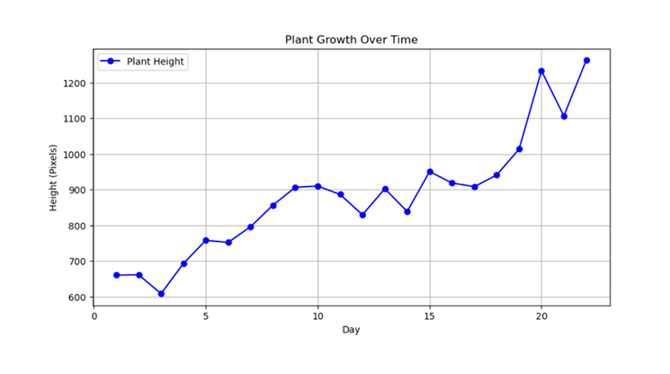
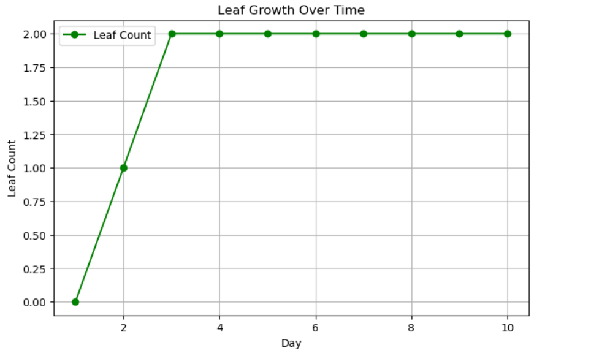
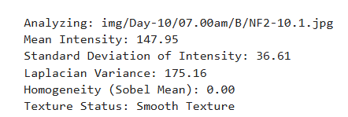

## we got a project to make an Image processing system that can monitoring plant growth in controlled environment as a mini project . 

## I used anaconda navigator with jupyter note book to do that project and used image processing libraries such as openCv ,numpy and matplotlib.The codes i have uploaded here as python files.

these codes measuring growth of plant by its hight and use leaf count and visual texture of its leafs to monitor its health.it measures daily growth and show the growth pattern as a graph.i will attach some examples below.it simply saying plant height by pixels.and count the leafs.more than that it showing growth pattern as below.i shered the image folder with this. you can use it or use your own images with changing only the image path in codes.

### Growth pattern showing as below.

### Leafcount showing like below.

### The visual Texture showing like below.

  
  